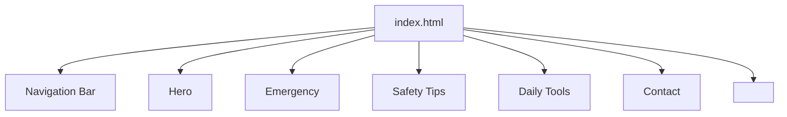

# Design Document

## Overview

SheSafe is a single-page static website built with plain HTML5 and CSS3 (no JavaScript frameworks, no backend). It serves as a daily safety companion for women, providing emergency contacts, safety tips, daily tools, and a contact form in a clean, responsive layout.

The site is delivered as a single `index.html` file with an accompanying `styles.css`. All interactivity (smooth scroll, hover effects, form validation) is handled by native browser behavior and minimal vanilla JavaScript for the mobile nav toggle and form feedback.

**Technology choices:**
- HTML5 semantic markup
- CSS3 with custom properties (variables) for theming
- Vanilla JavaScript (< 50 lines) for mobile nav toggle and form validation feedback
- Google Fonts (loaded via `<link>`)
- Inline SVG icons (no external icon font dependency)

---

## Architecture

The site is a single-page application (SPA in layout only — no routing). All sections live in one `index.html` and are navigated via anchor links with CSS `scroll-behavior: smooth`.

```
shesafe-website/
├── index.html        # All sections, semantic HTML
├── styles.css        # All styles, CSS custom properties, media queries
└── script.js         # Mobile nav toggle + form validation (minimal)
```

### Section Layout



### Responsive Breakpoints

| Breakpoint | Width     | Layout behavior                          |
|------------|-----------|------------------------------------------|
| Mobile     | < 768px   | Single column, hamburger nav             |
| Tablet     | 768px     | Two-column card grids                    |
| Desktop    | ≥ 1280px  | Three-column card grids, full nav bar    |

---

## Components and Interfaces

### Navigation Bar (`<header>`)

- Fixed or sticky at top
- Contains logo/title "SheSafe" and nav links: Home, Emergency, Safety Tips, Daily Tools, Contact
- On mobile (< 768px): links collapse behind a hamburger button; toggled via `script.js`
- Smooth scroll to sections via `scroll-behavior: smooth` on `html` element

```html
<header>
  <div class="nav-brand">SheSafe</div>
  <button class="nav-toggle" aria-label="Toggle navigation">☰</button>
  <nav>
    <ul>
      <li><a href="#home">Home</a></li>
      <li><a href="#emergency">Emergency</a></li>
      <li><a href="#safety-tips">Safety Tips</a></li>
      <li><a href="#daily-tools">Daily Tools</a></li>
      <li><a href="#contact">Contact</a></li>
    </ul>
  </nav>
</header>
```

### Hero Section (`#home`)

- Full-width banner with site title and tagline
- Background: gradient using primary palette (soft pink or green)
- Title: "SheSafe", Tagline: "Empowering Women with Safety and Confidence"

### Emergency Section (`#emergency`)

- SOS Button: large, red background (`#D32F2F`), white text, high contrast
- Emergency contacts displayed as a grid of contact cards:
  - Police: 100
  - Women Helpline: 1091
  - Ambulance: 108
- On mobile: single column, no horizontal scroll

### Safety_Card Component

Reusable card pattern used in Safety Tips and Daily Tools sections:

```html
<div class="card">
  <div class="card-icon"><!-- inline SVG --></div>
  <h3 class="card-title">Category Title</h3>
  <ul class="card-tips">
    <li>Tip 1</li>
    <li>Tip 2</li>
    <li>Tip 3</li>
  </ul>
</div>
```

CSS hover effect (applied to `.card`):
```css
.card:hover {
  box-shadow: 0 8px 24px rgba(0,0,0,0.15);
  transform: translateY(-4px);
  transition: box-shadow 0.2s ease, transform 0.2s ease;
}
```

### Safety Tips Section (`#safety-tips`)

Three Safety_Card components, one per category:
1. Travel Safety (≥ 3 tips)
2. Online Safety (≥ 3 tips)
3. Public Places Safety (≥ 3 tips)

Cards arranged in a responsive grid (1 → 2 → 3 columns across breakpoints).

### Daily Tools Section (`#daily-tools`)

Three Safety_Card components:
1. Safety Apps — recommended apps with short descriptions
2. Fake Call Trick — explanation of the technique
3. Self-Defense Tips — basic techniques

Each card includes an inline SVG icon and a short description. Same hover effect as Safety Tips cards.

### Contact Form (`#contact`)

```html
<form id="contact-form" novalidate>
  <label for="name">Name *</label>
  <input type="text" id="name" name="name" required>

  <label for="email">Email *</label>
  <input type="email" id="email" name="email" required>

  <label for="message">Message *</label>
  <textarea id="message" name="message" required></textarea>

  <button type="submit">Send Message</button>
</form>
```

- `novalidate` on the form so JavaScript controls validation feedback display
- On submit: `script.js` checks each required field; if invalid, adds `.error` class and shows an inline error message
- Email validated via `input.validity.valid` (native browser API)
- No backend submission — form shows a success message on valid submit

---

## Data Models

This is a static site with no dynamic data. All content is hardcoded in HTML. The relevant "data" structures are:

### Emergency Contact

```
{ label: string, number: string }
```
Examples: `{ label: "Police", number: "100" }`, `{ label: "Women Helpline", number: "1091" }`

### Safety Tip Category

```
{ category: string, icon: SVG string, tips: string[] }  // tips.length >= 3
```

### Daily Tool

```
{ title: string, icon: SVG string, description: string }
```

### Contact Form Submission (client-side only)

```
{ name: string (non-empty), email: string (valid email format), message: string (non-empty) }
```

---

## Correctness Properties

*A property is a characteristic or behavior that should hold true across all valid executions of a system — essentially, a formal statement about what the system should do. Properties serve as the bridge between human-readable specifications and machine-verifiable correctness guarantees.*

### Property 1: Form rejects empty required fields

*For any* combination of empty or whitespace-only values across the name, email, and message fields, the form validation function SHALL return false and mark every empty field with an error indicator, leaving the form unsubmitted.

**Validates: Requirements 5.2, 5.4**

### Property 2: Form rejects invalid email

*For any* string that does not conform to a valid email address format, the form validation function SHALL mark the email field as errored and prevent form submission.

**Validates: Requirements 5.3**

### Property 3: All interactive cards have consistent hover effects

*For any* element with the `.card` class anywhere on the page (Safety Tips or Daily Tools), the CSS `:hover` ruleset SHALL define both a `box-shadow` and a `transform` property, ensuring visual hover feedback is uniform across all card instances.

**Validates: Requirements 3.3, 4.5, 6.4**

### Property 4: Every Safety_Card contains an icon and meets minimum tip count

*For any* Safety_Card in the Safety Tips section, the card SHALL contain at least one SVG or icon element alongside its title, and its tip list SHALL contain a minimum of three items.

**Validates: Requirements 3.4, 6.5**

---

## Error Handling

| Scenario | Behavior |
|---|---|
| Required field empty on submit | Add `.error` class to field wrapper; show inline message "This field is required" |
| Invalid email on submit | Add `.error` class to email wrapper; show "Please enter a valid email address" |
| Valid form submit (no backend) | Hide form, show success message "Thank you! Your message has been received." |
| JavaScript disabled | Form falls back to native HTML5 `required` and `type="email"` validation |
| Images/icons fail to load | Inline SVG means no external load failures; icons always render |

---

## Testing Strategy

This is a static HTML/CSS site. Most behavior is UI rendering and layout, so property-based testing applies only to the form validation logic in `script.js` and CSS rule consistency checks. The majority of tests are example-based DOM assertions and smoke/layout tests.

**Unit Tests (example-based, using Vitest + jsdom)**

Form validation:
- Empty name → blocked, error shown
- Whitespace-only name → blocked, error shown
- Valid name + invalid email → blocked, email error shown
- All fields valid → success message shown
- Empty message → blocked, error shown

DOM structure:
- Nav contains all five links
- Emergency section contains SOS button and all three contact numbers
- Safety Tips section has three category cards
- Daily Tools section has apps, fake call, and self-defense cards
- Contact form has name, email, message inputs all marked `required`

**Property-Based Tests (using `fast-check`, minimum 100 iterations each)**

- Property 1: *For any* combination of empty/whitespace required fields, `validateForm()` returns false and marks each empty field as errored
  `// Feature: shesafe-website, Property 1: Form rejects empty required fields`

- Property 2: *For any* non-email string, `validateForm()` returns false and marks the email field as errored
  `// Feature: shesafe-website, Property 2: Form rejects invalid email`

- Property 3: *For any* `.card` element, its computed `:hover` CSS rules include `box-shadow` and `transform`
  `// Feature: shesafe-website, Property 3: All interactive cards have consistent hover effects`

- Property 4: *For any* Safety Tips card, it contains an SVG icon and at least 3 tip list items
  `// Feature: shesafe-website, Property 4: Every Safety_Card contains an icon and meets minimum tip count`

**Smoke / Layout Tests**

- Viewport 320px: no horizontal overflow, nav collapses, Emergency section fits
- Viewport 768px: two-column card grid renders correctly
- Viewport 1280px: three-column card grid, full nav bar visible
- Google Fonts `<link>` tag present in `<head>`

**Accessibility Checks**

- All form inputs have associated `<label>` elements
- SOS button color contrast meets WCAG AA (4.5:1 minimum)
- Nav toggle has `aria-label`
- Inline SVGs have `aria-hidden="true"` or a descriptive `<title>`
